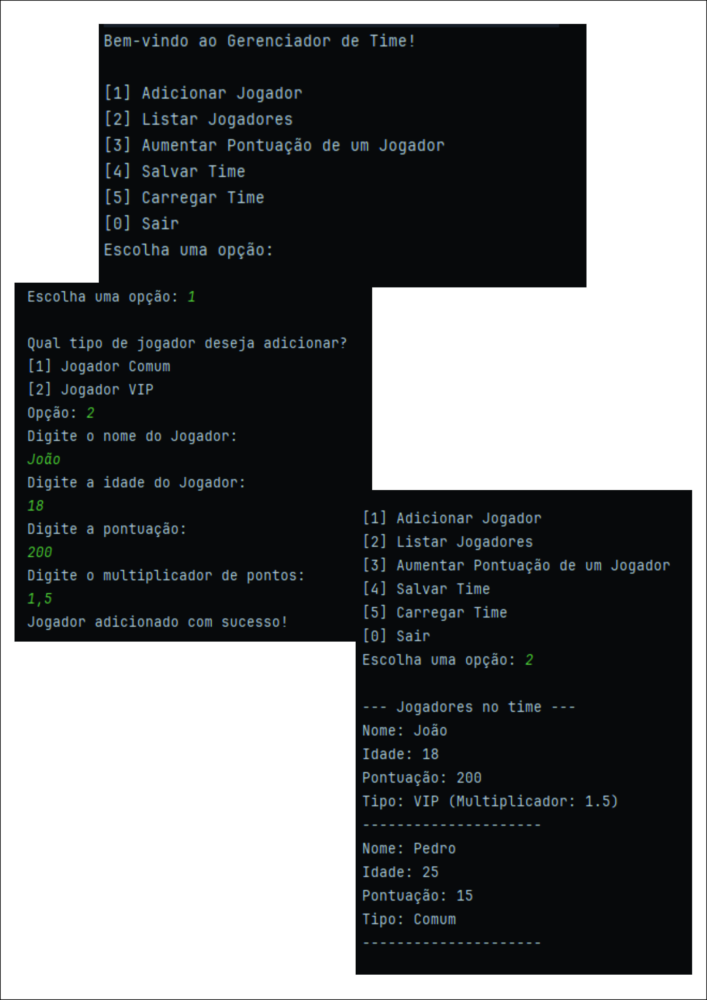

# Gerenciador de Time em Java

Este projeto é um sistema de gerenciamento de times de jogadores, desenvolvido em Java puro como um exercício prático para cobrir os conceitos fundamentais e avançados da Programação Orientada a Objetos. O programa roda via console e permite ao usuário realizar operações em uma lista de jogadores, além de persistir os dados em um arquivo.

## ✨ Funcionalidades

-   **Adicionar Jogadores:** Permite a criação de jogadores de dois tipos distintos: Comum e VIP.
-   **Listar Jogadores:** Exibe uma lista de todos os jogadores cadastrados com seus respectivos detalhes (nome, idade, pontuação e tipo).
-   **Aumentar Pontuação:** Permite selecionar um jogador pelo índice e adicionar pontos à sua pontuação.
    -   *A lógica de pontuação utiliza polimorfismo, onde jogadores VIP recebem um bônus com base em seu multiplicador.*
-   **Persistência de Dados:**
    -   **Salvar Time:** Salva a lista atual de jogadores em um arquivo `time.csv`.
    -   **Carregar Time:** Carrega os dados de um arquivo `time.csv`, substituindo a lista em memória.
-   **Interface de Console Robusta:** Menu interativo com tratamento de exceções para garantir que o programa não quebre com entradas inválidas do usuário.

## 🚀 Tecnologias e Conceitos Aplicados

Este projeto foi construído utilizando apenas Java padrão, com foco em demonstrar o domínio dos seguintes conceitos:

-   **Java Core:** Lógica de programação, estruturas de controle (`while`, `switch`, `if/else`), e manipulação de tipos de dados.
-   **Programação Orientada a Objetos (POO):**
    -   **Encapsulamento:** Atributos protegidos com o modificador `private` e acessados de forma segura através de Getters e Setters.
    -   **Herança:** Utilização da classe `JogadorVIP` que herda (com `extends`) características e comportamentos da classe base `Jogador`.
    -   **Polimorfismo:** Sobrescrita do método `aumentarPontuacao()` na classe `JogadorVIP` (`@Override`) e tratamento de objetos de tipos diferentes de forma unificada na lista, com verificação de tipo via `instanceof`.
-   **Estrutura de Dados:** Uso de `ArrayList` para criar uma coleção dinâmica de objetos `Jogador`.
-   **Manipulação de Arquivos (File I/O):** Leitura e escrita em arquivos de texto (`.csv`) utilizando `BufferedReader`, `BufferedWriter`, `FileReader` e `FileWriter`.
-   **Tratamento de Exceções:** Blocos `try-catch` para garantir a robustez do programa contra erros de entrada do usuário (`InputMismatchException`) e erros de arquivo (`IOException`).

## ⚙️ Como Executar o Projeto

1.  Certifique-se de ter o **JDK (Java Development Kit)** versão 8 ou superior instalado.
2.  Clone este repositório para a sua máquina local.
3.  Abra a pasta do projeto em uma IDE Java, como o **IntelliJ IDEA** ou **Eclipse**.
4.  Execute o método `main` localizado na classe `GerenciadorDeTime.java`.

## 📸 Demonstração

